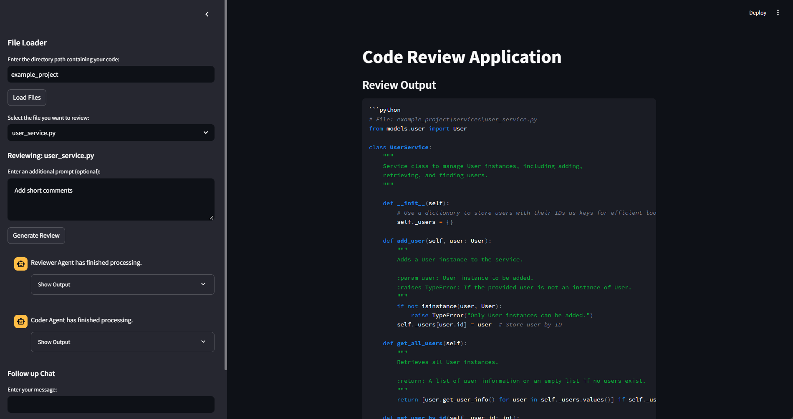

# CrewAI Code Review

## Overview

CrewAI Code Review is an AI-powered tool designed to analyze, review, and suggest improvements for codebases. It automates the process of identifying defects, optimizing structure, and completing missing code elements. By leveraging CrewAI, it ensures efficient and structured reviews, helping developers enhance code quality and maintainability.

## Key Features

- **Automated Code Review**: Detects defects, inefficiencies, and areas for improvement in source code.
- **AI-Powered Code Completion**: Fills in missing code components based on context and best practices.
- **Review Reports**: Generates detailed feedback highlighting issues and recommendations.
- **Customizable Review Process**: Uses configurable agents and tasks to tailor reviews to project needs.
- **Interactive Analysis**: Provides an interface to explore and refine code based on AI insights.

## How It Works

1. The system scans source code and extracts sections for review.
2. AI agents analyze the code, identifying defects and potential enhancements.
3. A structured report is generated, outlining detected issues and suggested fixes.
4. AI-powered completion module fills in missing logic and corrects errors according to review report. 
5. The results can be further refined with user input, making the review process interactive and adaptable.

## Applications

- **Code Quality Assurance**: Ensures adherence to coding standards and best practices.
- **Refactoring Support**: Identifies redundant or inefficient code for optimization.

CrewAI Code Review enhances software development workflows by providing automated, AI-driven insights, ensuring robust and maintainable codebases.

